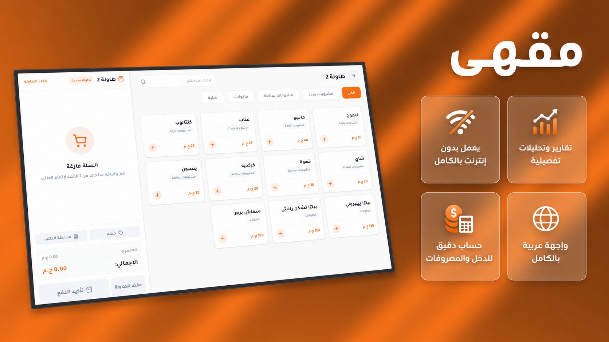

  

# ☕ Maqhaa POS | مقهى

### High-Performance, Offline-First Cafe & Restaurant Management System

**Zero Subscriptions · 100% Offline-First · Lifetime Ownership · Built for High-Volume Hospitality**

  

    
    
  

  

    <a href="#-the-problem--solution">The Pitch</a> •
    <a href="#-key-architectural-features">Architecture & Features</a> •
    <a href="#-interactive-demo-engine">Interactive Demo</a> •
    <a href="#-edition-matrix--pricing">Editions & Pricing</a> •
    <a href="#-hardware--peripherals">Hardware Compatibility</a> •
    <a href="#-tech-stack--quickstart">Developer Quickstart</a> •
    <a href="#-contact--orders">Contact</a>
  

   

  

---

## ⚡ The Problem & The Solution

Most modern POS software traps business owners in **fragile cloud-dependent architectures** and **predatory recurring SaaS subscriptions**. When the internet drops during rush hour, orders stall, kitchens disconnect, and revenue is lost.

**Maqhaa POS** is engineered from the ground up to solve this:

- **100% Offline-First Execution:** Operates entirely locally with zero latency, eliminating cloud downtime risks.
- **True Lifetime Ownership:** No monthly fees, no annual renewals, and no vendor lock-in.
- **Hospitality-Grade Precision:** Sub-second checkout flows, multi-printer ticket dispatching, recipe-based unit inventory, and granular audit trails.

---

## 🚀 Key Architectural & Product Features

<table>
  <tr>
    <td width="50%">
      <h3>⚡ Offline-First Local Engine</h3>
      
Instantaneous response times with zero network overhead. All order transactions, cart state, and table sessions execute locally on client hardware without internet dependency.

    </td>
    <td width="50%">
      <h3>🖨️ Multi-Station Print Dispatcher</h3>
      
Simultaneous thermal receipt (80mm) generation with automated routing: sends drink tickets to the Barista station and meal orders to the Kitchen line instantly.

    </td>
  </tr>
  <tr>
    <td width="50%">
      <h3>📦 Recipe-Level Inventory Deductions</h3>
      
Tracks granular ingredients (grams, milliliters, pieces). Deducts raw materials in real-time on every order checkout, alerts on stock depletion, and tracks waste/spoilage.

    </td>
    <td width="50%">
      <h3>🪑 Dynamic Table & Order Workflows</h3>
      
Full support for <b>Dine-In</b> (interactive table maps & bill splitting), <b>Takeaway</b> (rapid 3-click checkout), and <b>Delivery</b> tracking.

    </td>
  </tr>
  <tr>
    <td width="50%">
      <h3>📊 Financial Audits & Shift Management</h3>
      
Cashier shift reconciliation, cash drawer balancing, real-time sales analytics, tax calculation engines, and automated daily Z-reports.

    </td>
    <td width="50%">
      <h3>🛡️ Role-Based Security & Anti-Theft</h3>
      
Fast PIN-code operator switching, permission isolation (cashier vs. manager), void/discount audit logs, and automated local data backups.

    </td>
  </tr>
</table>

---

## 🎮 Interactive Demo Engine

The web showcase includes a fully interactive simulated POS sandbox allowing prospective clients to test core workflows before purchasing:

- **Live Point of Sale Simulator:** Real-time item additions, modifier selections (sugar, milk substitutes, extra shots), discounts, and tax computations.
- **Table Layout Grid:** Visual state manager demonstrating table occupancy, open tabs, and bill settlement.
- **Thermal Receipt Generator:** Live 80mm ESC/POS-styled receipt preview reflecting active cart changes dynamically.

👉 **[Launch Interactive Web Demo](https://maqhaa.abdelrahmanashraf.dev)**

---

## 💎 Edition Matrix & Pricing

Maqhaa offers straightforward, one-time lifetime licenses tailored to business scale:

| Feature / Capability                          | ☕ Standard Edition (6,000 EGP) | 🚀 Premium Edition (18,000 EGP) |
| :-------------------------------------------- | :-----------------------------: | :-----------------------------: |
| **Licensing Model**                           |      **One-time Lifetime**      |      **One-time Lifetime**      |
| **Fast POS Screen & Barcode Search**          |               ✅                |               ✅                |
| **Product Modifiers & Add-ons**               |               ✅                |               ✅                |
| **Dine-in Table & Takeaway Management**       |               ✅                |               ✅                |
| **80mm Thermal Receipt Printing**             |               ✅                |               ✅                |
| **Cashier Shifts & Cash Reconciliation**      |               ✅                |               ✅                |
| **Multi-Currency & Tax Config**               |               ✅                |               ✅                |
| **Automated Local Backups**                   |               ✅                |               ✅                |
| **Recipe-Level Inventory (g / ml / unit)**    |               ❌                |               ✅                |
| **Depletion Alerts & Auto-Disabling Items**   |               ❌                |               ✅                |
| **Supplier & Purchase Order (PO) Management** |               ❌                |               ✅                |
| **Waste & Spoilage Tracking**                 |               ❌                |               ✅                |
| **Multi-Printer Routing (Kitchen / Barista)** |               ❌                |               ✅                |

---

## 🖥️ Hardware & Peripherals Compatibility

Built to integrate seamlessly with standard commercial POS hardware:

- **Operating Systems:** Windows 10, Windows 11, Touch All-in-One POS terminals.
- **Thermal Printers:** Standard 80mm thermal receipt printers (USB / Ethernet / Network).
- **Barcode & QR Scanners:** 1D/2D USB plug-and-play scanners.
- **Cash Drawers:** RJ11 automated kick-out cash drawers triggered on receipt print.
- **Display Input:** Optimized for high-responsiveness on Touchscreen monitors.

---

## 📞 Inquiries & Orders

Ready to deploy Maqhaa in your cafe or restaurant, or interested in licensing/custom integrations?

   
  
    
  
<b>Direct Phone / WhatsApp:</b> <a href="tel:+201123593773">+20 112 359 3773</a>

  
<b>Official Website:</b> <a href="https://maqhaa.abdelrahmanashraf.dev">maqhaa.abdelrahmanashraf.dev</a>

  
<b>Lead Developer:</b> <a href="https://abdelrahmanashraf.dev">Abdelrahman Ashraf</a>

 

  © 2026 Maqhaa POS. Built with passion for seamless hospitality operations.

